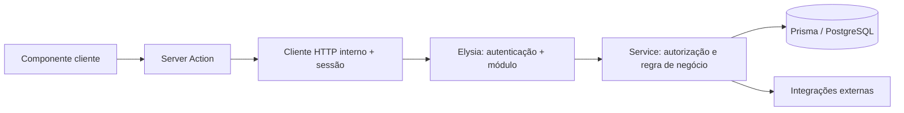

# ADR-004: Acesso a dados entre Next.js e Elysia

- **Status:** Adotado com estrutura simplificada para autenticação.
- **Data:** 2026-10-02.
- **Contexto:** frontend Next.js em `apps/web`; API Elysia + Prisma em `apps/api`.

## Base da proposta

O [guia de segurança do Next.js](https://nextjs.org/docs/app/guides/data-security)
descreve tanto consumo de APIs HTTP existentes quanto uma DAL interna. Para a
DAL, destaca execução no servidor, autorização e retorno de DTOs mínimos.
Isso orienta limites de acesso; não impõe um nome de pasta ou acesso direto
ao banco pelo Next.

Nossa recomendação é usar a API Elysia como fonte dos dados de domínio e uma
camada de acesso exclusiva do servidor Next para consumi-la. Prisma e regras
de negócio continuam na API. Assim, não haverá dois caminhos independentes
de acesso ao mesmo banco.

Na autenticação atual, as Server Actions executam as operações diretamente
por meio do cliente HTTP. A camada `server/data/auth.ts` foi removida porque
suas funções eram usadas somente pelas actions. Uma DAL separada poderá ser
extraída quando existirem consultas ou operações compartilhadas por múltiplos
consumidores. Os nomes das pastas não são uma exigência do Next.js.

O frontend agora possui `proxy.ts` na raiz de `apps/web`. Ele faz apenas a
checagem otimista de presença do cookie nas rotas protegidas, preserva o
destino interno no redirecionamento para login e tira usuários já autenticados
das páginas públicas de autenticação. O proxy não acessa o banco, não
decodifica JWT e não substitui a autorização do Elysia.

## Fluxos



Quando houver consultas em Server Components, eles poderão chamar funções
de acesso compartilhadas no servidor. Não precisam
fazer HTTP para as próprias rotas `/api` do Next; essa volta adicional é
desaconselhada pelo [guia de BFF](https://nextjs.org/docs/app/guides/backend-for-frontend).
As mutações de autenticação usam Server Actions em `app/(auth)/actions.ts`.
A antiga rota `app/api/auth/[action]/route.ts` foi removida. Outros consumidores
HTTP e webhooks usam o backend Elysia; não existe mais `app/api` no frontend.

## Organização

```text
apps/web/
  app/                       # páginas e layouts
    (auth)/actions.ts        # operações, validação e resultados seguros
  components/                # apresentação e interação
  server/
    config.ts                # ambiente privado; import 'server-only'
    session.ts               # gravação/limpeza do cookie; não expõe token
    api-client.ts            # destino fixo, timeout, validação de saída e erros
  lib/
    auth.ts                  # helpers puros/clientes; nunca importa server/

apps/api/src/
  config/                    # configuração da API
  plugins/                   # autenticação e extensões do Elysia
  modules/<dominio>/
    index.ts                 # transporte HTTP e validação
    model.ts                 # schemas e tipos derivados
    service.ts               # casos de uso, autorização e transações
    repository.ts            # opcional: consultas complexas ou reutilizadas
  services/                  # banco e adaptadores de integrações
```

`server/` contém somente infraestrutura compartilhada do frontend. A estrutura de módulos
preserva `index.ts`, `model.ts` e `service.ts`, conforme nossas instruções e
as [boas práticas do Elysia](https://elysiajs.com/essential/best-practice).
Não criar um repository genérico nem arquivos vazios para cada entidade.
Extrair consultas do service quando existir complexidade ou reutilização real.

## Responsabilidades e limites

1. O Next mantém tokens no servidor e entrega às telas objetos com campos
   explicitamente selecionados e respostas validadas. Evitar repassar objetos
   completos da API com spread ou apenas convertê-los com `as Tipo`.
2. Nas futuras operações protegidas, o cliente HTTP interno encaminhará a
   credencial ao Elysia. As operações atuais de autenticação são públicas.
   A existência de um cookie não comprova sessão válida: a API verifica assinatura, expiração
   e revogação, como já faz `plugins/auth.ts`.
3. O service da API valida vínculo com a clínica, papel e acesso ao recurso
   em cada operação protegida. Um `organizationId` vindo da URL ou do corpo
   é entrada não confiável. Esconder botões ou redirecionar páginas não substitui
   essas verificações. Ver [autorização no Next](https://nextjs.org/docs/app/guides/authentication).
4. A API recebe webhooks e executa integrações de domínio, como WAHA e
   transcrição. Webhooks autenticam a origem pelo mecanismo do provedor;
   jobs usam contexto de serviço explícito. Não inventar sessão de usuário
   para esses fluxos nem permitir que contornem os limites da organização.
5. `server-only` protege imports no Next; não autentica uma chamada.
   `use server` tem outra finalidade: expõe funções como Server Functions.
   Apenas as seis operações remotas são exportadas de `actions.ts`; schemas
   e helpers permanecem privados. Os módulos de infraestrutura usam `server-only`.
6. Dados de sessão e clínicos começam sem cache persistente compartilhado.
   [React cache](https://react.dev/reference/react/cache) permite deduplicação
   durante renderizações de Server Components, com invalidação entre requests;
   não deve ser tratado como cache global de autorização ou garantia de
   deduplicação em handlers.

## Implementação e próximos passos

A autenticação usa `app/(auth)/actions.ts` → `server/api-client.ts` → Elysia.
Configuração e cookie estão isolados em
`server/config.ts` e `server/session.ts`. `lib/auth.ts` contém apenas tipos,
navegação e interpretação dos resultados, sem fetch nem configuração privada.
As entradas e respostas são validadas com Zod. Falhas previstas retornam
um resultado discriminado; detalhes internos não são enviados ao navegador.
O reset bem-sucedido também limpa o cookie local.

Os testes cobrem DTO sem campos extras, cookie seguro, dados inválidos,
erros da API, configuração ausente e os seis fluxos públicos de autenticação.

Próximos passos:

1. Definir no contrato da API consulta de sessão atual e logout com revogação,
   ainda ausentes, antes de depender deles nas telas protegidas.
2. Integrar onboarding e clínica quando suas branches forem incorporadas.
3. Verificar sessão revogada, acesso entre clínicas, respostas sem tokens ou
   campos extras e reutilização das funções por diferentes entradas.

## Referências enviadas e limites da pesquisa

O [resumo do Sintesy](https://app.sintesy.me/s/245d7a7f-ef68-4118-9165-5cccb47b85bf?v=summary)
e o [artigo de Ayush](https://aysh.me/blogs/data-access-layer-nextjs) foram lidos
como material complementar; a proposta acima se apoia nas fontes oficiais
citadas. A [discussão no Reddit](https://www.reddit.com/r/nextjs/comments/1j8vm5g/questions_about_the_proposed_data_access_layer_in/)
levanta a diferença entre consultas e autorização de webhooks. No
[artigo de NestJS](https://javascript.plainenglish.io/the-data-access-pattern-a-clean-architecture-approach-to-database-management-in-nest-js-9ece64b4362e),
somente a introdução estava acessível; a implementação está atrás de assinatura.
